# 🎨 AI Image Generation Tutor: Guiding Learning with a Conversational Agent
# AI 圖像生成助教：建構一個對話式圖像生成代理人並引導學習

[](https://unity.com/)
[](https://github.com/AUTOMATIC1111/stable-diffusion-webui)
[](https://aistudio.google.com/)
[](https://youtu.be/dvgTzGWRYK8)
[](https://drive.google.com/file/d/17XuxVGuz0Tx9AxdcEJduVH1oWiUJQoTb/view?usp=sharing)

## 📖 專案簡介 (Introduction)

本專題開發了一套互動式圖像生成教學系統，旨在引導使用者從基礎的提示詞輸入，進階至能夠精確操控圖像生成的專家。系統結合了 **Large Language Models (LLM)**、**Live2D 虛擬角色**與**語音回饋**，提供多樣化的學習模式與考核機制。

此外，系統包含一個 **對話式圖像生成代理人**，讓使用者能透過自然語言對話，經由系統自動提取參數並運用 ControlNet、LoRA 等技術，生成符合需求的理想圖像。

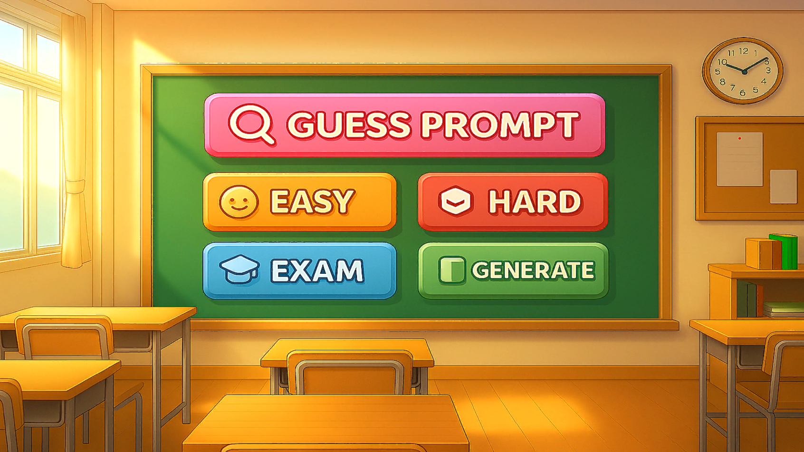

### 🎥 成果展示 (Demo)
> **[點擊觀看 YouTube 完整演示影片](https://youtu.be/dvgTzGWRYK8)**

---

## ✨ 主要功能 (Key Features)

本系統設計了五種互動模式，滿足不同階段的學習需求：

### 1. 簡單模式 (Easy Mode)
* **功能說明**：透過圖像對照，辨識技術差異。
* **學習重點**：模型選擇、Prompt、LoRA、解析度。

#### 📸 系統介面與教學效果展示
| **1. 答題畫面示意圖** | **2. 結算畫面示意圖** |
| :---: | :---: |
| 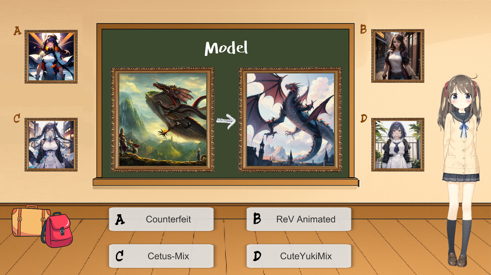 | 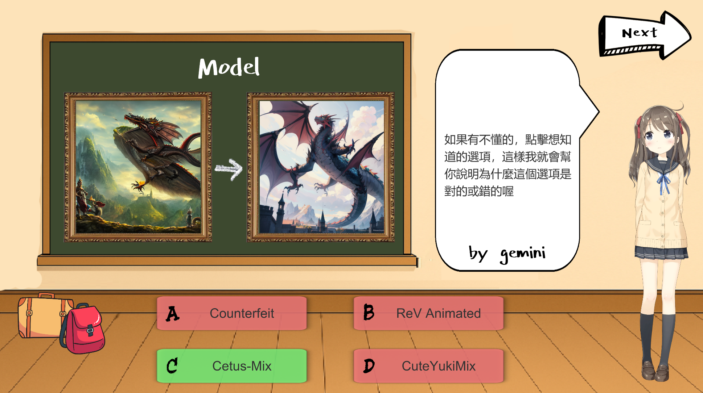 |

| **3. Model 選擇效果** | **4. Prompt 效果** |
| :---: | :---: |
| 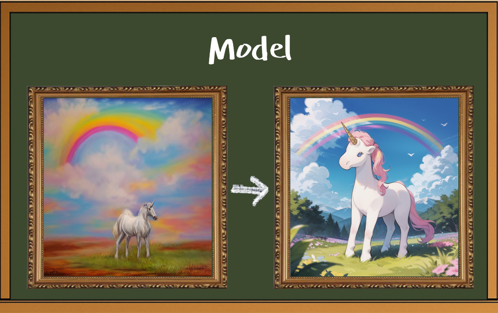 | 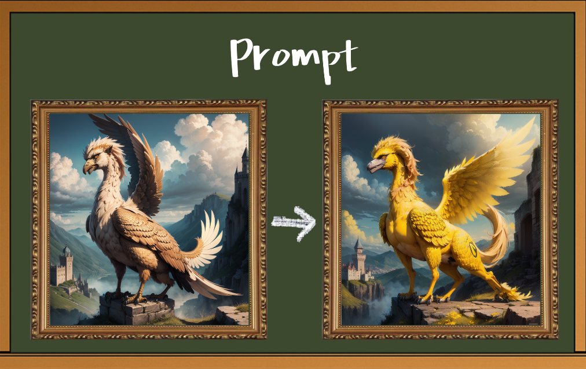 |

| **5. LoRA 效果** | **6. Resolution 效果** |
| :---: | :---: |
| 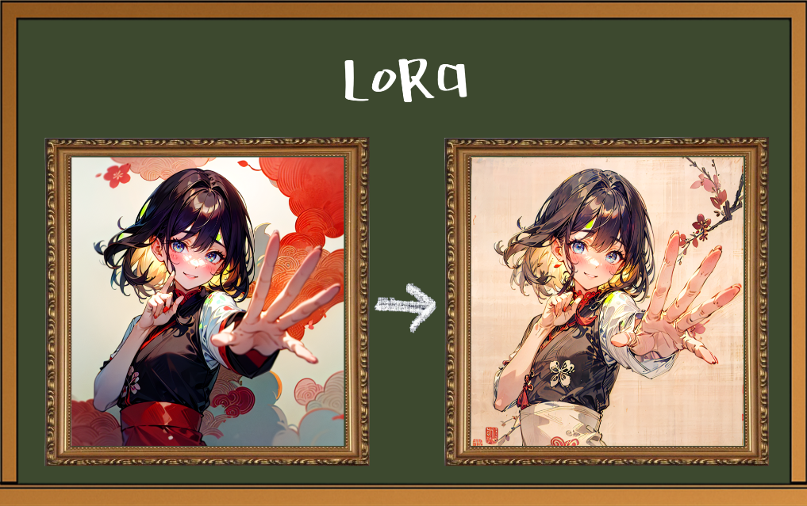 | 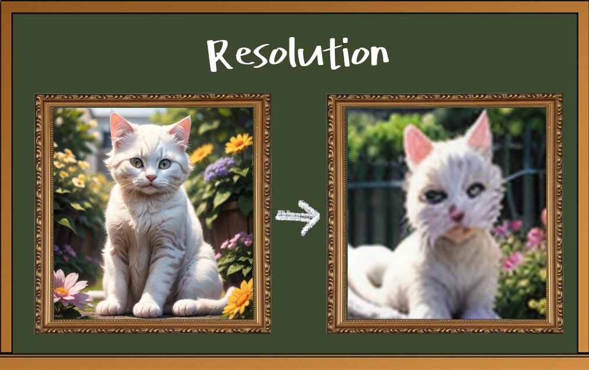 |

---

### 2. 困難模式 (Hard Mode)
* **功能說明**：觀察融合圖像，判斷複合技術組合。
* **學習重點**：ControlNet、多重技術混合應用。

| **1. 答題畫面示意圖** | **2. 結算畫面示意圖** |
| :---: | :---: |
| 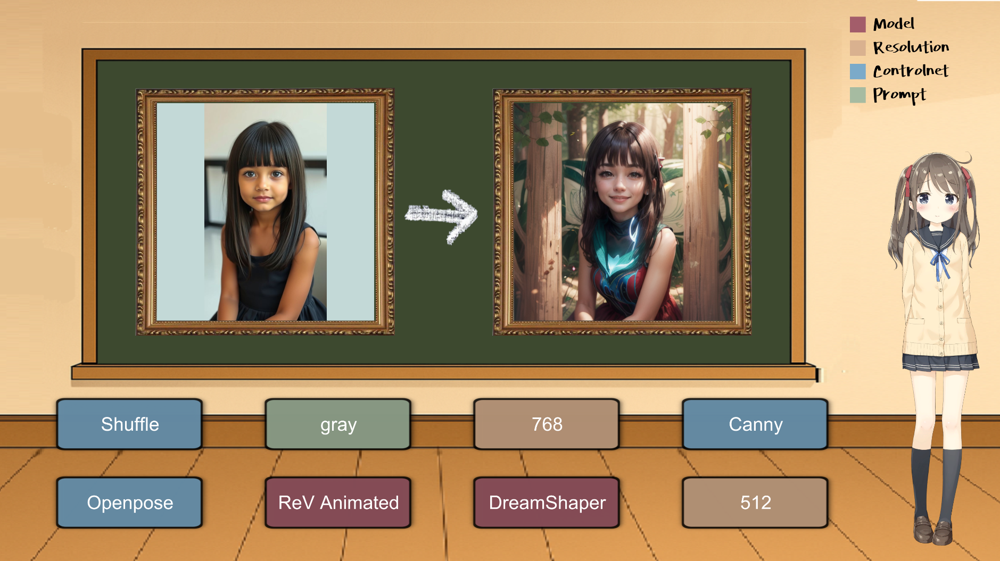 | 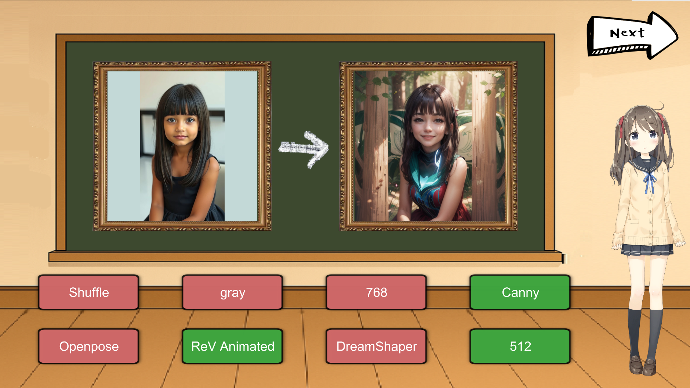 |

---

### 3. 猜詞模式 (Guess Mode)
* **功能說明**：推測特定區域的提示詞 (基於 MultiDiffusion)。
* **學習重點**：提示詞撰寫、區域控制 (Region Control)。

| **1. 答題畫面示意圖** | **2. 結算畫面示意圖** |
| :---: | :---: |
| 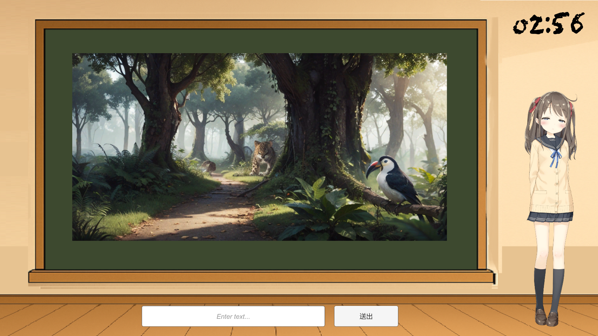 | 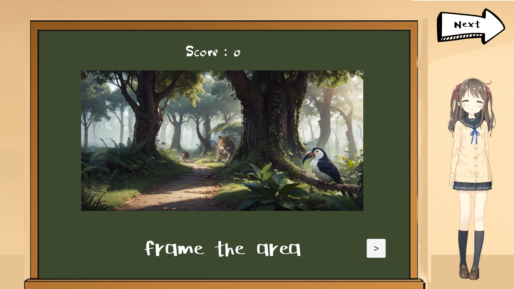 |

---

### 4. 考核模式 (Exam Mode)
* **功能說明**：使用者需自行設定參數，嘗試生成與題目極為相似的圖像，系統將量化相似度進行評分。
* **學習重點**：綜合實戰能力評量。

| **1. 答題畫面示意圖** | **2. 結算畫面示意圖** |
| :---: | :---: |
| 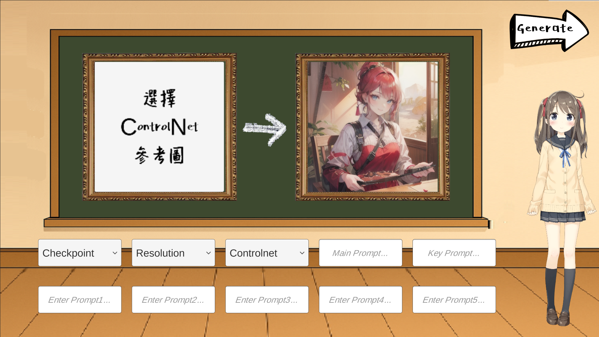 | 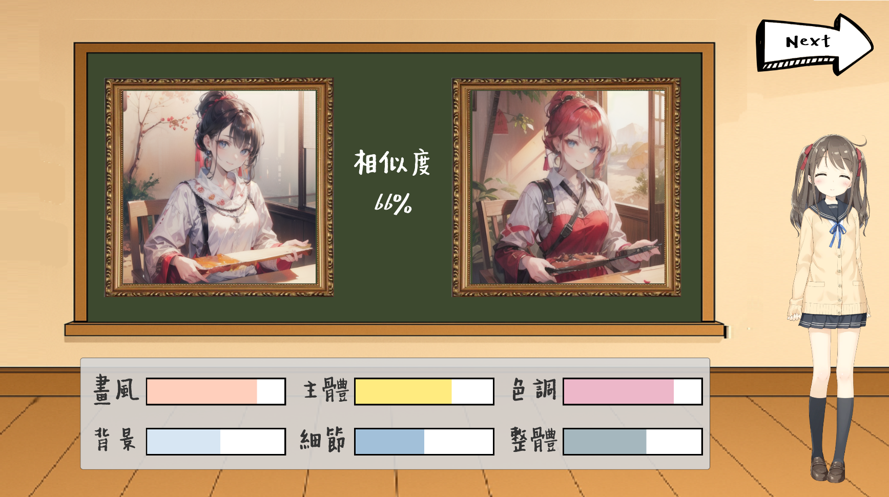 |

---

### 5. 匠人模式 (Craftsman Mode)
* **功能說明**：對話式代理人協助生成，並提供多樣種類的自定義細節。
* **學習重點**：自由創作、自然語言轉參數。

| **1. 對話式代理人示意圖** | **2. 參數檢查示意圖** |
| :---: | :---: |
| 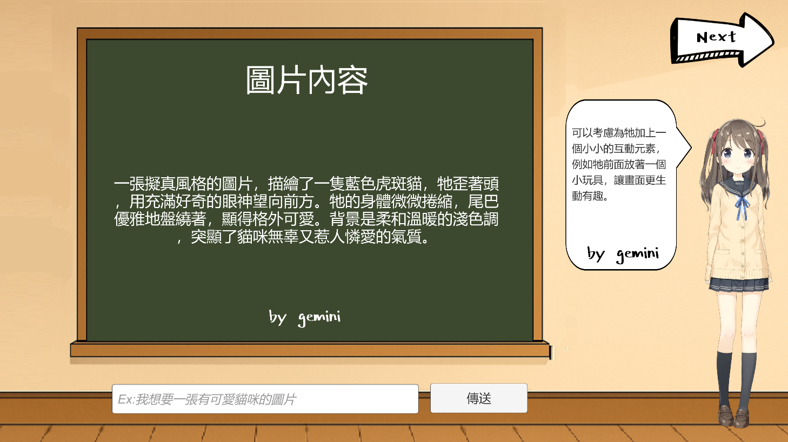 | 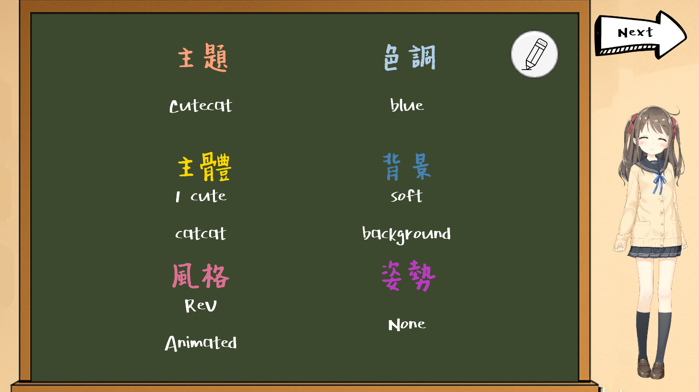 |

| **3. 自定義細節示意圖** | **4. 結果畫面示意圖** |
| :---: | :---: |
| 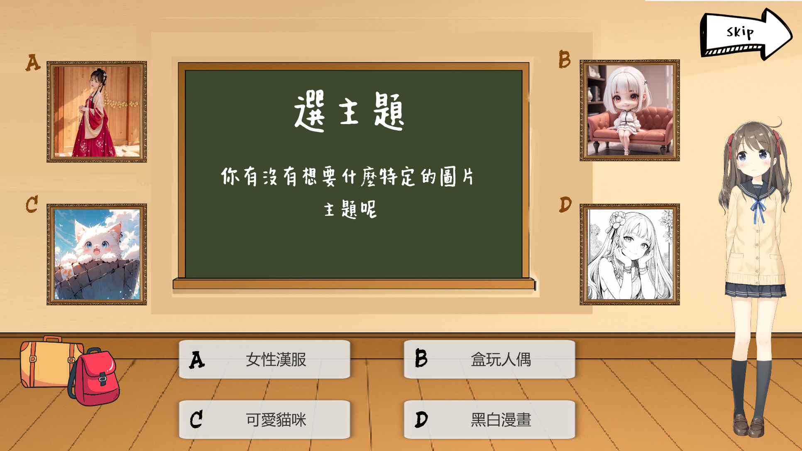 | 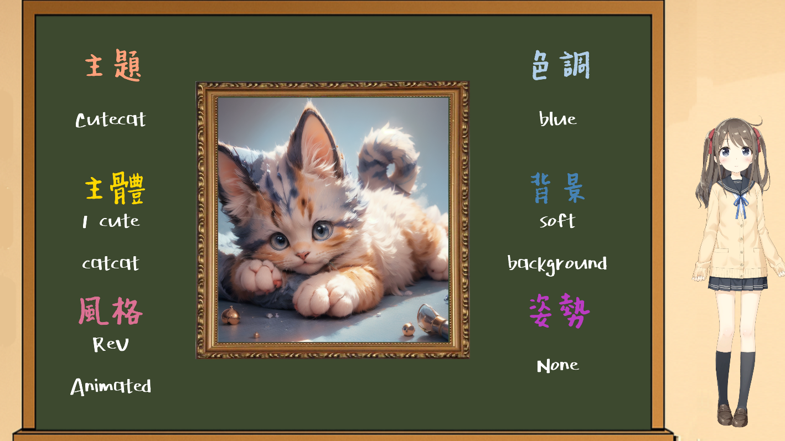 |

---

## 💻 環境需求 (Prerequisites)

為了確保圖像生成與系統運作順暢，建議您的電腦符合以下規格：

* **作業系統**: Windows 10 / 11 (64-bit)
* **GPU**: NVIDIA GeForce RTX 3060 以上 (建議 VRAM 8GB 以上)
* **RAM**: 16GB 以上
* **軟體依賴**: Python 3.10.x, Git

---

## 🛠️ 技術架構 (Technology Stack)

本系統整合了多項前沿 AI 技術與開發工具：

* **核心引擎**: Unity (負責介面與流程控制)
* **大語言模型**: Gemini 2.5 Flash-Lite (負責題目生成、資訊提取、對話互動)
* **圖像生成**: Stable Diffusion v1.5 (整合 ControlNet, LoRA, MultiDiffusion)
* **語音/虛擬人**: CozyVoice / Live2D
* **微調技術**: LoRA (包含自訓練模型)、Textual Inversion、ADetailer

---

## 🚀 安裝方式 (Installation)

請依照以下步驟完成環境建置與檔案替換：

### 1. 下載主程式與 WebUI
1. 前往 [Releases](https://github.com/matthew930823/AI-Image-Generation-Tutor/releases) 下載 **AI-Image-Generation-Tutor** 並解壓縮。
2. 前往 [Github](https://github.com/AUTOMATIC1111/stable-diffusion-webui) 下載 **stable-diffusion-webui-master** 並解壓縮。

### 2. 設定啟動參數
利用記事本編輯 `stable-diffusion-webui-master/webui-user.bat`，在 `set COMMANDLINE_ARGS=` 後面加上以下參數：
```bat
set COMMANDLINE_ARGS=--xformers --autolaunch --theme dark --api
```
注意：`--api` 參數對於 Unity 與 SD 的連線至關重要。
### 3. 初始化環境
1. 執行 `stable-diffusion-webui-master/webui-user.bat`。
2. 等待命令提示字元 (cmd) 執行，直到瀏覽器自動跳出 `http://127.0.0.1:7860` 畫面（這表示基礎環境安裝成功）。
3. 回到 `cmd` 視窗中按下 `CTRL+C`，然後輸入 `Y` 結束執行並關閉視窗。

### 4. 替換模型與擴充套件 (關鍵步驟)
請下載以下資料夾，並**取代** `stable-diffusion-webui-master` 目錄下的同名資料夾（建議先備份原資料夾，或直接覆蓋）：

| 資料夾名稱 | 下載連結 | 說明 |
| :--- | :--- | :--- |
| **models** | [Google Drive 下載](https://drive.google.com/file/d/1225faesdEkALrjyPjGiuyLtPkeUhbBYR/view?usp=sharing) | 包含 SD v1.5 及 ControlNet 等模型 |
| **extensions** | [Google Drive 下載](https://drive.google.com/file/d/1aWy3xzgNLw_FiXXJ-svKDx5xsQhZA4On/view?usp=sharing) | 包含 ControlNet, LoRA 相關插件 |
| **embeddings** | [Google Drive 下載](https://drive.google.com/file/d/14Ep12LbgJix1XQkQgH7gSwTmBTW5cKG2/view?usp=sharing) | 包含 Textual Inversion 檔案 |

### 5. API Key 設定 (⚠️請確認)
* 本系統包含 Gemini 對話功能，請確保已在專案設定檔中填入您的 **Gemini API Key**，以便對話代理人正常運作。
---

## 🎮 使用方式 (Usage)

請依照以下順序啟動系統：

1. **啟動後端**：開啟 `stable-diffusion-webui-master/webui-user.bat`，等待瀏覽器自動跳出 `http://127.0.0.1:7860`。
2. **啟動前端**：執行 `AI-Image-Generation-Tutor/AI圖像生成助教執行檔/AItest.exe`。
3. **開始體驗**：
    * 若遇到連線問題，請確認 `webui-user.bat` 的黑底視窗是否正常運作且未被關閉。
    * 若對話無回應，可能是 LLM 呼叫頻率限制，請稍後再試。

---

## 📂 LoRA 模型資料集

本專題也嘗試以 Snoopy 風格為主題，訓練出專屬的 LoRA 微調模型，自訓練之 LoRA 模型資料集可於以下連結下載：  
👉 [Google Drive 下載](https://drive.google.com/drive/folders/1KJ8zi5uhN3mLTzKApngOKMTSjnxnZAYD?usp=sharing)

| **1. 微調前** | **2. 微調後** |
| :---: | :---: |
|  |  |

---

## 👥 作者與貢獻 (Authors)

[cite_start]**國立臺灣海洋大學 資訊工程學系 (NTOU CS)** 指導教授：張欽圳 博士 

| 姓名 | 學號 | 主要職責 | 貢獻度 |
| :--- | :--- | :--- | :--- |
| **楊宏立** | 01157025 | 系統設計、技術學習、LoRA模型自訓練、實驗設計與測試、報告撰寫  | 50% |
| **李孟修** | 01157005 | 系統實作、語音生成整合、虛擬人物整合  | 50% |

---

## 📄 參考文獻 (References)

本專案參考了 Stable Diffusion, ControlNet, LoRA, MultiDiffusion 等多項學術研究與開源技術，詳細參考文獻請參閱專題報告。

---
[cite_start]*Created as part of the Graduation Project at National Taiwan Ocean University, 2025.* 
